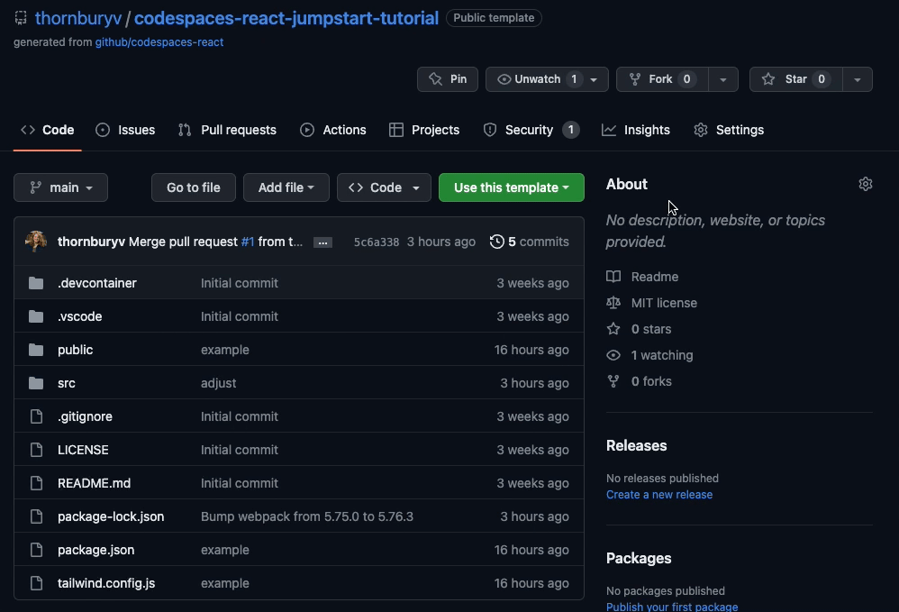
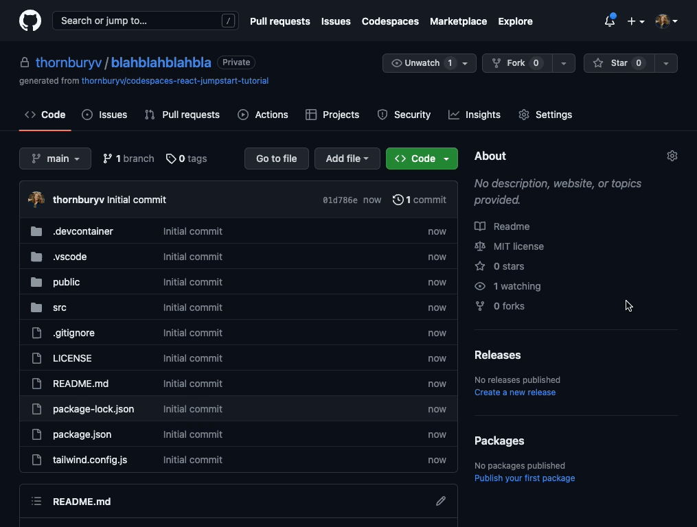
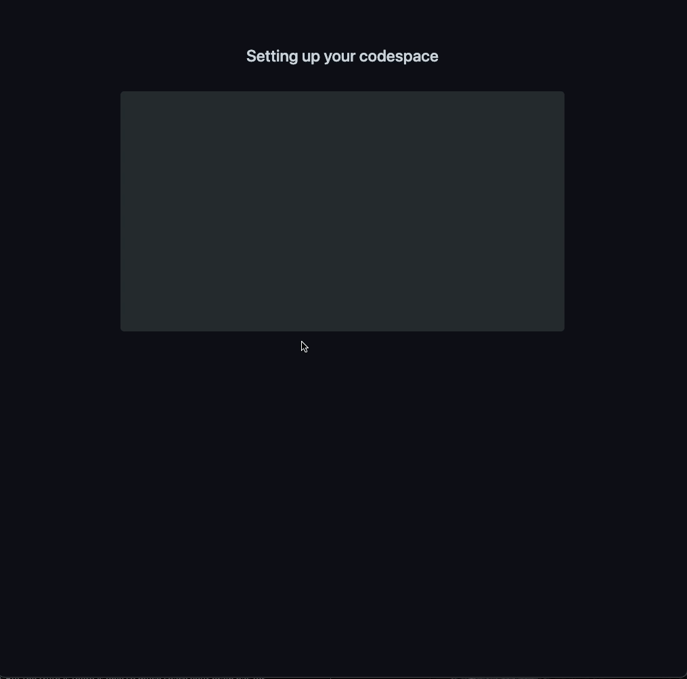
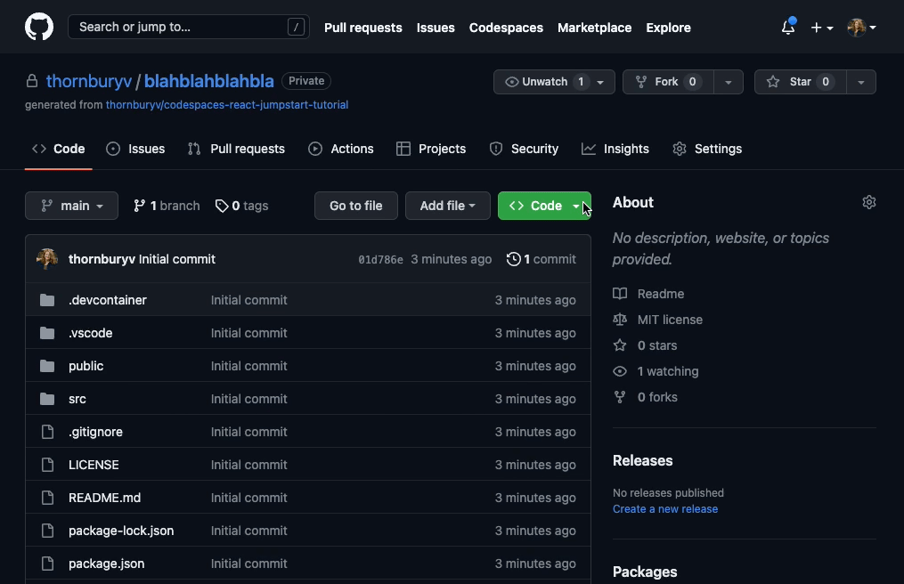
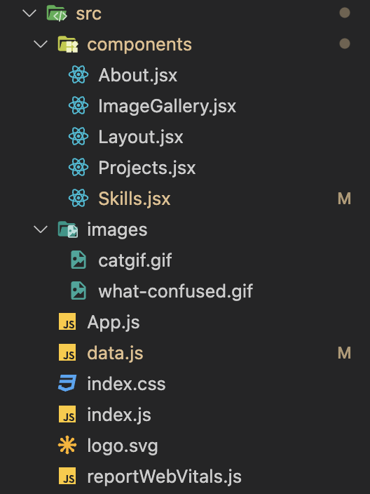
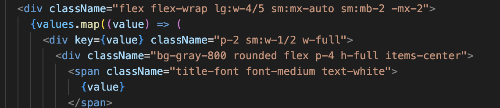

# GitHub Codespaces + React + TailwindCSS

This basic React App uses GitHub codespaces for easy development. It allows you to run your code editor in the browser and automatically sets up the development environment and launches the app.

---

## To use this Template:

1. Click “Use this template” and then select “create a new repository”
Name your repository whatever you like. Make it public for now so we can share with each other.

---

### 2. Once your Repository has been created, click “Code” and select “Create codespace on Main”

---

### 3. This will launch the codespace in your browser. It could take a minute or two, so don’t touch anything until it has loaded and you can see the website in the right hand tab. 

### 4. Once you are done developing, make sure you stop the active codespace instance in your repository. Click “Code” find the active codespace, click the three dots and select “stop codespace”. You can also relaunch your code space by selecting “open in browser” 

## File Structure: 

The src (source) folder contains the “source code” of you application. You will mainly be working on files within this folder. 

Under src, you will see a components folder and an images folder. The images folder is where you will put any images you wish to use for your website. 

The components folder contains the various files of code that make up the frontend. 
The Layout component determines how the components are arranged in page. 
About
Skills
Projects

Image gallery is dynamically generated based on which project you click on. This is a key element of React, reusable components that display different content the same way. 

Data is brought into the components by importing objects from the data.js file in the src folder. 

Change the data in the data file and it will show up on the front end. 

---

## TailwindCSS

The styling of the application – colors, font, layout, responsiveness, are all set using tailwindcss in the “ClassName” attribute on individual html tags. [Checkout the documentation here](https://tailwindcss.com/docs/installation)

Play around! Have fun, make it your own. A few tips:

Make small changes and make sure it’s doing what you want before moving on, especially with the tailwindcss. You want to be able to quickly undo something that breaks the site or doesn’t work the way you want. Utilize the undo option and look at your live site frequently.

Try not to mess with files outside of the src folder too much. They are generated automatically and handle many of the behind-the-scenes aspects of displaying a website. 
